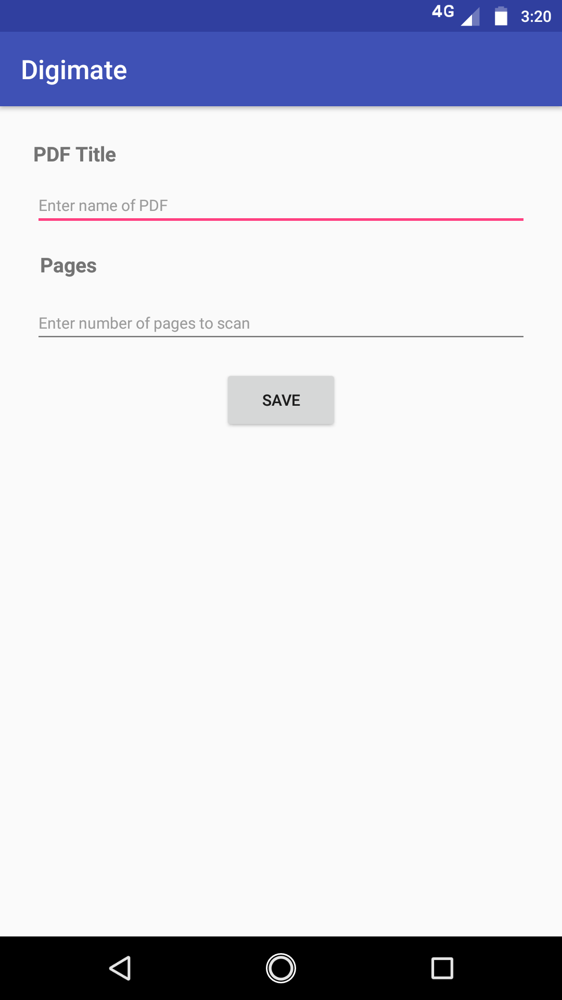
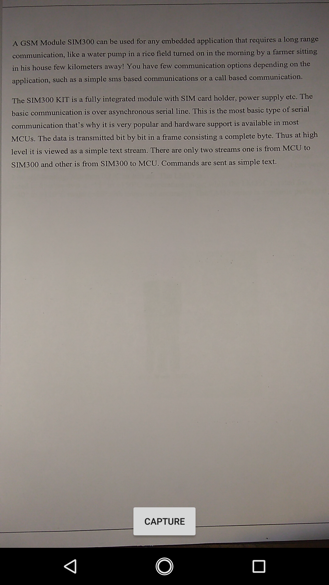
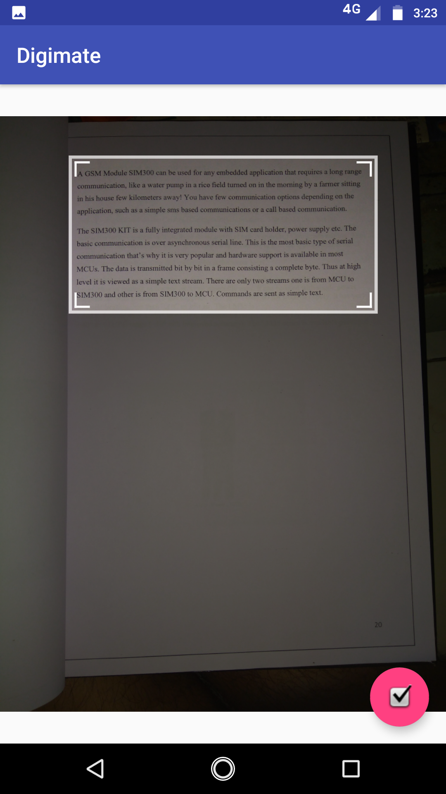
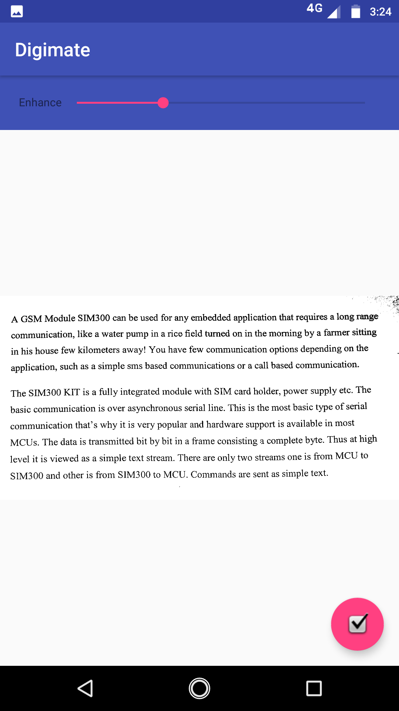
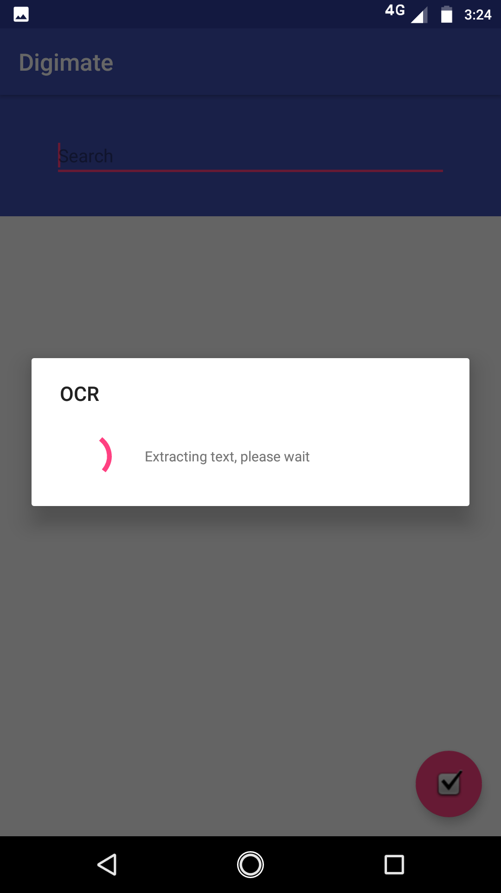
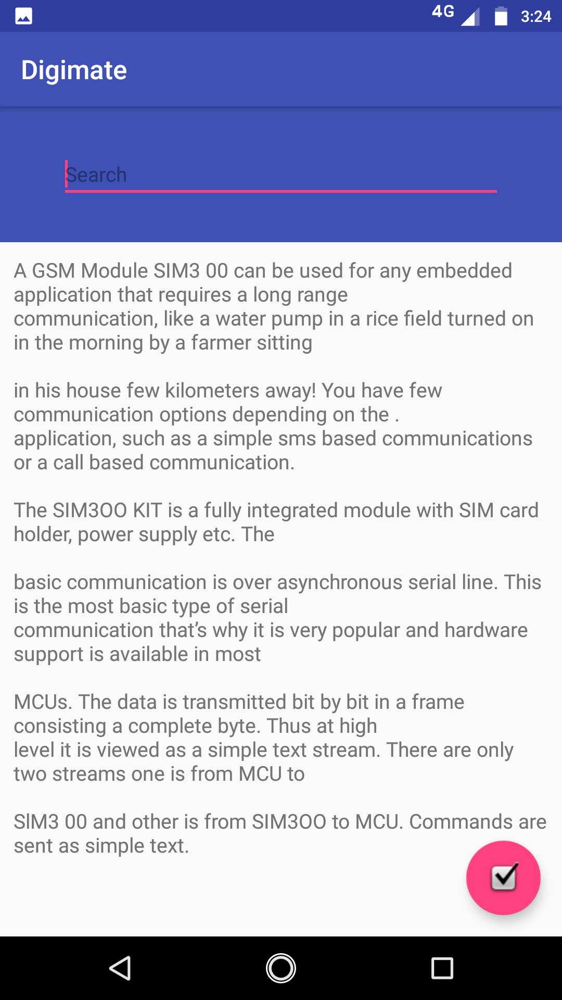
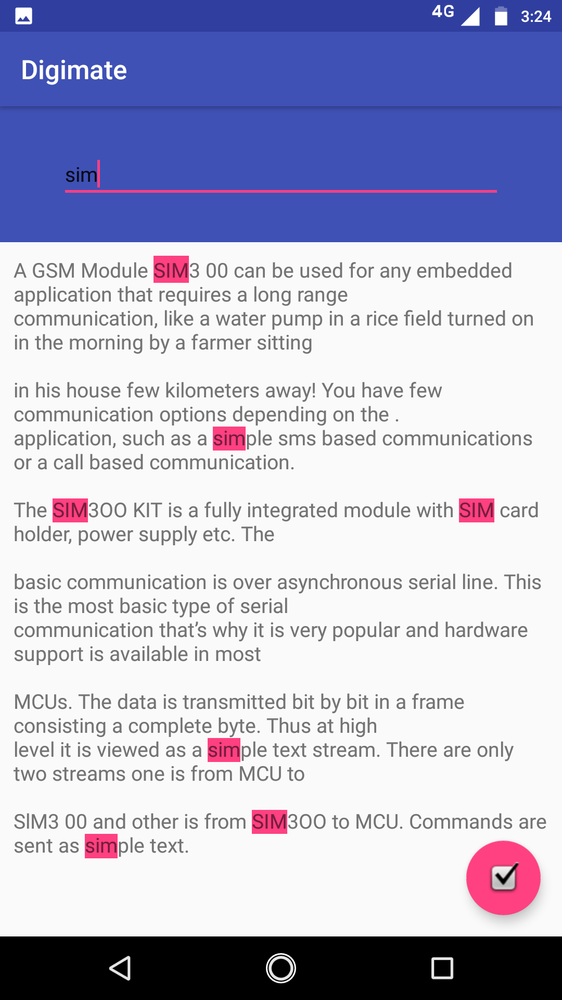
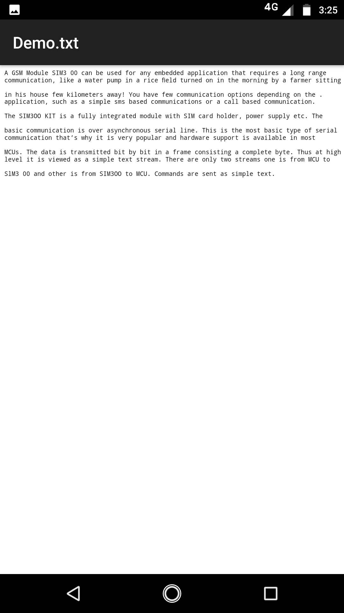

# digimate
An android application for image to text conversion using optical character recognition(OCR)

### Overview

Digimate allows you to extract text from camera preview directly. It is an experimental application for Android that performs optical character recognition (OCR) on images captured using the device camera.

Runs the Tesseract OCR engine using [tess-two](https://github.com/rmtheis/tess-two), a fork of Tesseract Tools for Android.

### Features

* convert images to pdf
* recognize text in images
* basic document management
* search text in generated content

### Usage

The application consists of:
- Capture Image (Camera Preview)
- Crop
- Rotate
- Binarize (enhance image)
- Recognize Text (English)
  - Search
  - Copy to clipboard
- Generate a text file and captured images PDF

### Libraries

- [android-image-cropper](https://github.com/ArthurHub/Android-Image-Cropper): for image cropping.
- [tess-two](https://github.com/rmtheis/tess-two): to recognize text (tesseract) and binarize (leptonica).

### Support

- Android 4.0 +

### Installation

To build and run the app, clone this project, open it as an existing project in Android Studio, and click Run.

### Advantages

- flexible
- web or multi-media tie-up
- user friendly
- cost effective
- inclined to adopt digitization
- automates the manual traditional process by generating content as a digital version
- digitize multiple pages in concurrent and time saving manner
- efficient retrieval of content using indexing and searching

### Future Scope

Government bodies, archivists, publishers etc. have a large number of printed documents stored physically which is inconvenient in searching, securing and maintaining as compared to digital documents.

We plan to build a prototype that will digitally migrate printed documents to editable text, without manually flipping the pages. Our system will generate a indexed digital version of the document by using cloud based OCR (Optical character recognition).

### Contributing

Bug reports and pull requests are welcome on GitHub at https://github.com/maanavshah/digimate. This project is intended to be a safe, welcoming space for collaboration, and contributors are expected to adhere to the [Contributor Covenant](http://contributor-covenant.org) code of conduct.

### License

The content of this repository is licensed under [MIT LICENSE](LICENSE).

### Screenshots

